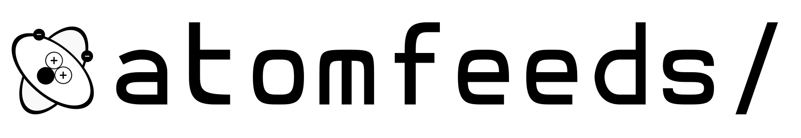

# atomfeeds

A lightweight, static-site-compatible CMS for personal blogs and feeds.

atomfeeds lets you manage posts, profile metadata, and contact links locally through a simple editor, then publish a fully static site that works on GitHub Pages, Netlify, or any other static host.

## Screenshots

### Viewer View


### Editor View


## Architecture

The project is split into two environments:

- **Local Editor:** A Node.js/Express server (`server.js`) that provides a local UI to create posts, edit metadata, and manage contacts through a Markdown editor.
- **Static Output:** The `atomfeeds/` directory contains the generated, fully static site that can be deployed as-is.

## Local Development

1. Install dependencies:

```bash
npm install
```

2. Start the local editor:

```bash
node server.js
```

3. Open [http://localhost:8000](http://localhost:8000) to manage your site, write posts, and configure the UI.

## Publishing

The complete publishable site lives inside the `atomfeeds/` directory.

To deploy on GitHub Pages, Netlify, or any other static hosting provider, publish **only** the `atomfeeds/` folder. Root-level editor files such as `server.js`, `editor.js`, and `functions/` are used only for local editing and do not need to be uploaded.

## Features

- Local post editing with Markdown support
- Static-site-compatible output
- Profile and metadata management
- Contact link configuration
- Easy deployment to static hosts

## License

This project is licensed under the MIT License.